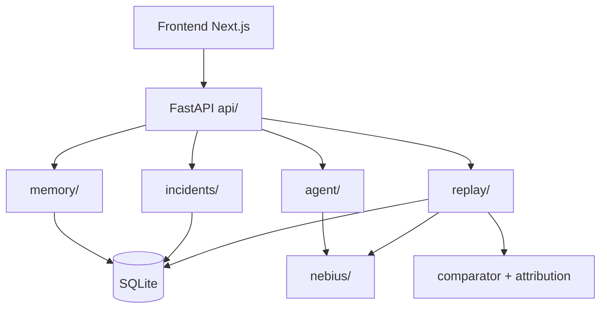

# L10 — Service

MVP = modular monolith (one FastAPI process). Boundaries are Python packages, extractable later.

## Service Diagram

## Ownership

| Service | Package | Owns tables |
|---|---|---|
| Memory | `backend/memory` | `memories` |
| Agent | `backend/agent` | `decision_requests`, `decisions` |
| Incident | `backend/incidents` | `incidents`, `replay_snapshots` |
| Replay | `backend/replay` | `replay_runs`, `attribution_results` |
| Nebius | `backend/nebius` | — (stateless client) |
| Session/User | `backend/api/sessions.py` | `users`, `sessions` |

## API Contract

| Method | Path | Req | Res |
|---|---|---|---|
| POST | `/api/session` | — | `{session_id}` |
| POST | `/api/memory` | `{content,type}` | Memory |
| GET | `/api/memories` | — | Memory[] |
| POST | `/api/agent/decide` | `{session_id,message}` | `{decision_id,selected_option_id,memory_ids_used}` |
| POST | `/api/incidents` | `{decision_id}` | Incident + snapshot_id |
| POST | `/api/incidents/{id}/replay` | — | ReplayRun[] + stability |
| POST | `/api/incidents/{id}/counterfactual` | — | ReplayRun[] per memory |
| GET | `/api/incidents/{id}/attribution` | — | ranked AttributionResult[] |
| POST | `/api/memories/{id}/quarantine` | — | Memory (QUARANTINED) |
| POST | `/api/memories/{id}/restore` | — | Memory (ACTIVE) |
| POST | `/api/demo/reset` | — | `{ok}` |

Errors: `400` validation, `404`, `409` bad state transition, `502` Nebius failure.
Long replays: return `202` + poll/SSE (decision at Phase 6 if latency > 10s).

## Data Entities

users, sessions, memories, decision_requests, decisions, incidents, replay_snapshots, replay_runs, attribution_results (fields per [source plan §9](source-plan.md)).

## Deployment Unit

| Unit | Content |
|---|---|
| `backend` | FastAPI + SQLite file |
| `frontend` | Next.js app |
| Local run | `scripts/start.sh` starts both |
