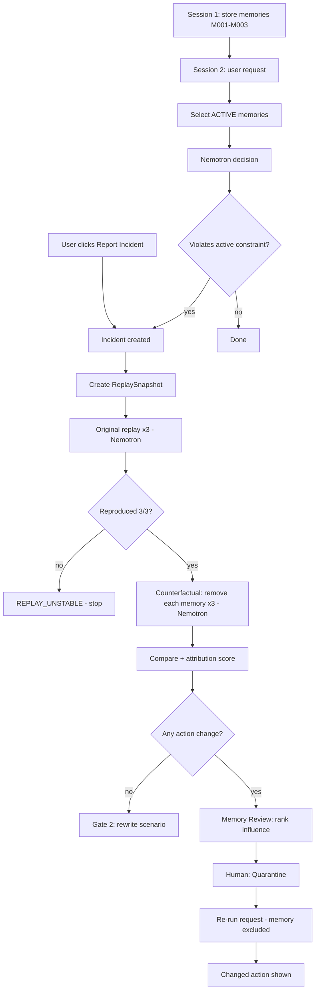

# L4 — Workflow

## Business Process (main flow)

## Steps

| # | Step | Actor |
|---|---|---|
| 1 | Store memory | User/Personal AI |
| 2 | Submit decision request | User |
| 3 | Select ACTIVE memories | System |
| 4 | Decide | Nemotron |
| 5 | Detect / report incident | System / User |
| 6 | Snapshot context | System |
| 7 | Original replay ×3 | Nemotron |
| 8 | Remove-one replay ×3 each | Nemotron |
| 9 | Compare, score, stability | System |
| 10 | Review + quarantine | User |
| 11 | Verify future decision | Nemotron |

## Exception Flow

| Exception | Handling |
|---|---|
| Nebius unreachable / 401 | Gate 0 stop; show error, log friction |
| Rate limit / 429 | Backoff retry (max 3), log friction |
| Invalid model JSON | Retry once → INVALID run |
| Replay unstable | Stop attribution, show `REPLAY_UNSTABLE` |
| No action change | Report Gate 2 failure |
| Quarantine of non-ACTIVE memory | 409 |

## Parallel Tasks

- Counterfactual conditions (3 memories) can run concurrently (asyncio, bounded concurrency e.g. 4).
- 3 repeats per condition can run concurrently.
- Total MVP calls: (1 original + 3 CF) × 3 = **12** Nemotron calls per incident.
