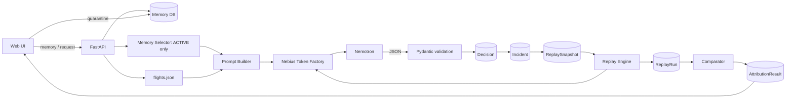

# L5 — Data Flow

## Data Flow Diagram

## Source Mapping

| Data | Source | Sink |
|---|---|---|
| Memory | User message (Session 1) | `memories` |
| Options | `data/flights.json` | `decision_requests.options_json`, snapshot |
| Decision | Nemotron JSON | `decisions` |
| Snapshot | Decision context | `replay_snapshots` |
| Replay output | Nemotron JSON | `replay_runs` |
| Attribution | Comparator | `attribution_results` |
| Memory status | User action | `memories.status` |

## Data Classification

| Class | Items |
|---|---|
| Personal (user preference) | memories, user_message |
| Operational | decisions, runs, latency, model_name |
| Config | prompts, prompt_version, hash |
| Secret | `NEBIUS_API_KEY` |

## Sensitive Data

- Memories are personal data → sent to Nebius for inference; document in README privacy note.
- API key only in `.env` (git-ignored); never logged, never in client bundle.
- Demo uses synthetic data only.
- No chain-of-thought persisted.

## Realtime / Cache

- No cache for model calls (replay must hit real inference).
- Snapshots are immutable (never updated after creation).
- UI polls or streams replay progress (SSE optional).

## Replay Fidelity Rule

Snapshot must freeze: `user_message`, `options_json` (order), `memory_ids` + memory content at that time, `model_name`, `prompt_version`, `system_prompt_hash`. Content frozen so later edits/quarantine don't alter replay.
