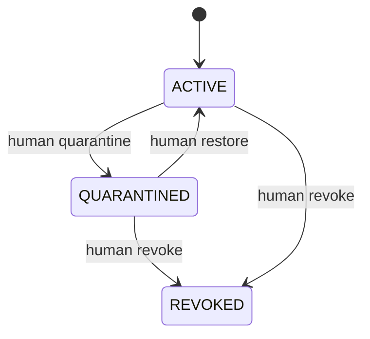
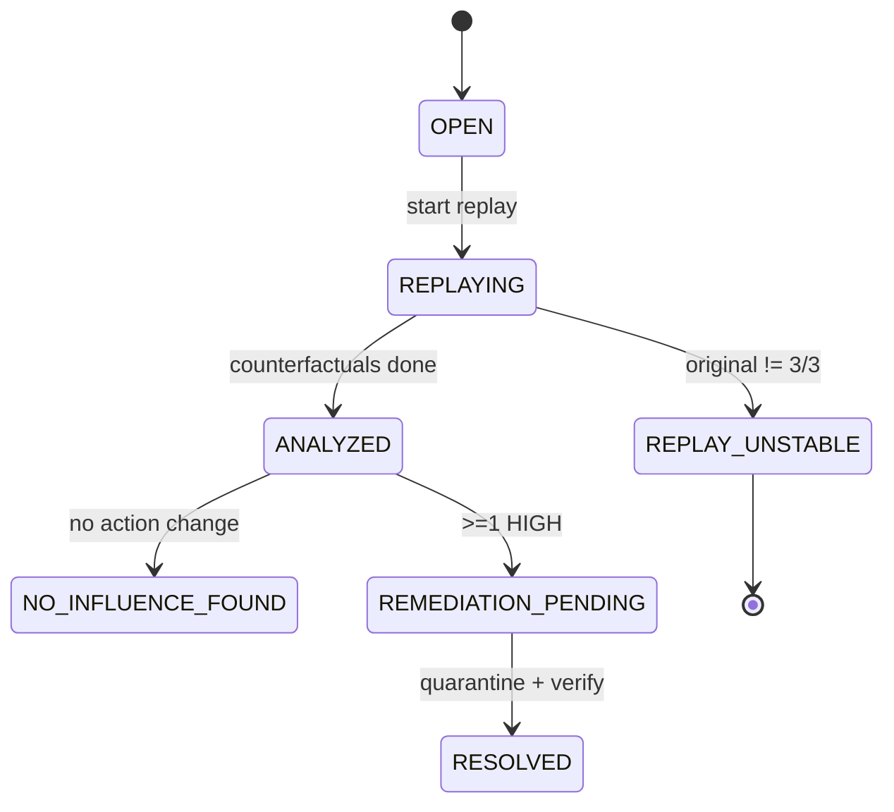

# L6 — State Flow

## Memory

- Selector includes ACTIVE only.
- REVOKED is terminal.

## Incident

## ReplayRun

`PENDING → RUNNING → COMPLETED | INVALID | FAILED`

## Condition Stability

| Runs (3) | Result |
|---|---|
| All same action | STABLE |
| Mixed | UNSTABLE |
| ≥1 INVALID/FAILED | INCOMPLETE |

## Transition Rules

| From → To | Guard |
|---|---|
| OPEN → REPLAYING | Snapshot exists |
| REPLAYING → ANALYZED | Original STABLE and == original decision; all CF conditions complete |
| ANALYZED → REMEDIATION_PENDING | Any condition with score ≥ 0.67 (HIGH) |
| REMEDIATION_PENDING → RESOLVED | Memory quarantined AND verification decision ≠ original action |
| Memory ACTIVE → QUARANTINED | Human request only (never automatic) |

## Recovery / Retry / Human

| Case | Policy |
|---|---|
| Transient API error (5xx, timeout, 429) | Retry ×3, exponential backoff 1s/2s/4s |
| Schema-invalid output | Retry ×1 |
| Persistent failure | Run FAILED; condition INCOMPLETE; surface in UI |
| Unstable original | Human sees `REPLAY_UNSTABLE`; no attribution |
| Wrong quarantine | Human restores (QUARANTINED → ACTIVE) |
| Process restart mid-replay | Resume incomplete runs by snapshot id (idempotent) |

## Retry Policy

- Max 3 attempts per call; per-call timeout 60s (reasoning model).
- Retries do not count as extra stability runs.

## Attribution Thresholds

| Score (changed/total) | Level |
|---|---|
| ≥ 0.67 | HIGH |
| 0.34–0.66 | MEDIUM |
| ≤ 0.33 | LOW |

MEDIUM may also apply when action is unchanged but decision factors differ significantly (post-MVP).
